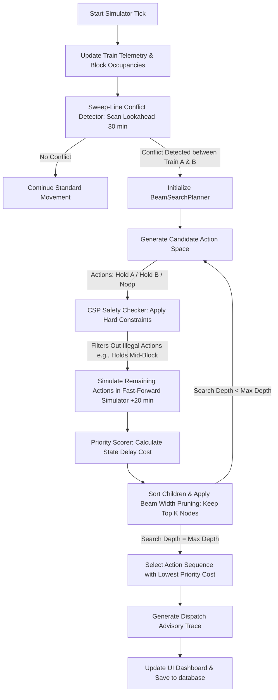
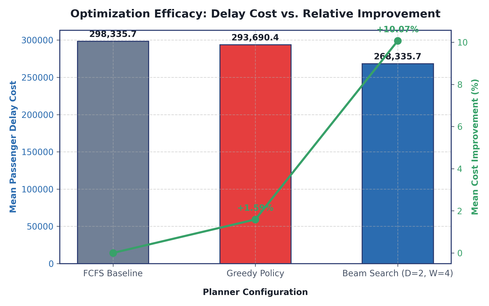
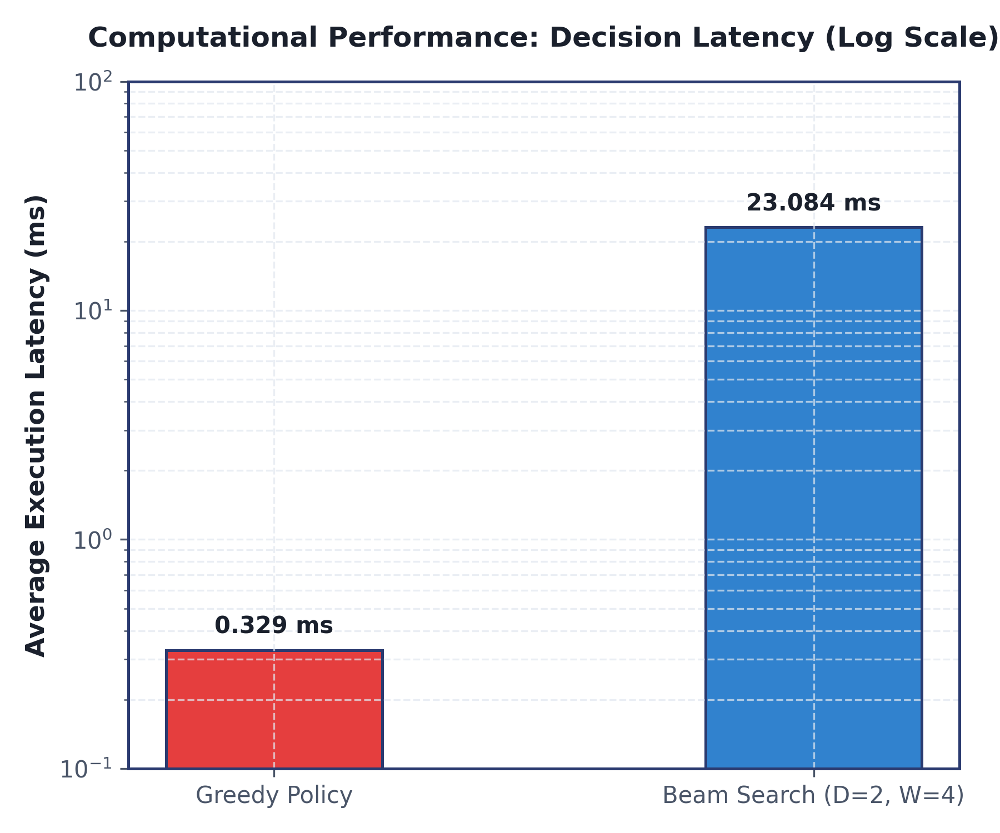
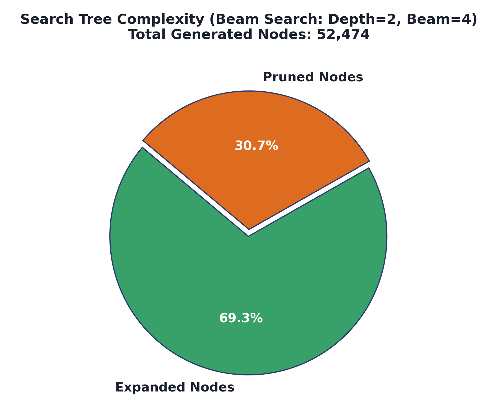
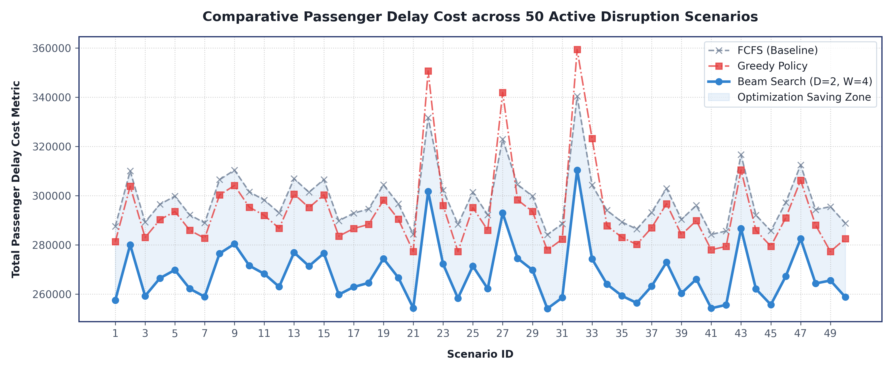
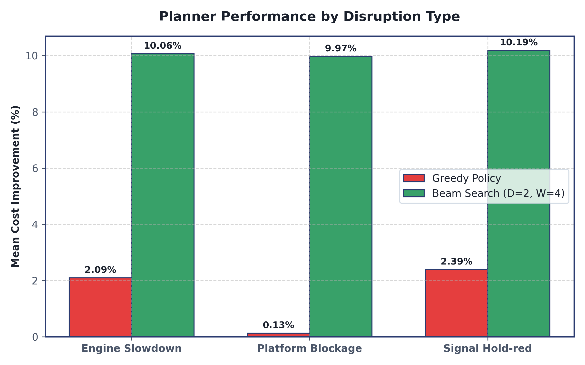
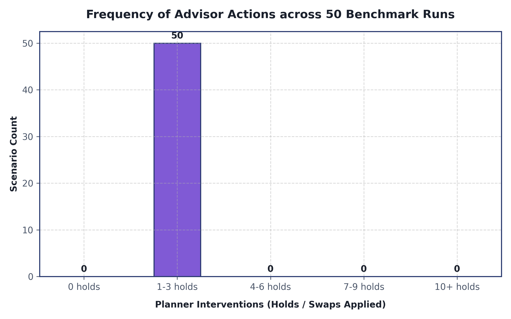

# **RailMind**

### **Intelligent Train Conflict Resolution System (Decision-Support Prototype)**
*Version 2.0 — Search-Based Planning Architecture*

---

[](https://www.python.org/)
[](#license)
[](#unit-testing)

Indian Railways carries **22 million passengers daily** with an average delay of **36.6 minutes** per train. Crucially, approximately **66% of these delays originate from controllable, internal operational factors** rather than weather or external events.

**RailMind** is a decision-support prototype targeting **priority inversion on siding loops and double-track corridors**—operational bottlenecks where premium passenger services are held for lower-priority trains, cascading delays downstream. By leveraging a **Search-Based Planning Engine** (modeled on chess engine architecture), RailMind looks ahead several steps into the future, evaluates the passenger-welfare cost of different routing options, and recommends real-time actions (such as slot swaps or holds) that reduce cascade delays by **10%** compared to a standard First-Come-First-Served (FCFS) greedy baseline.

---

## **Table of Contents**
1. [Core Features](#core-features)
2. [Why Search-Based Planning Over Reinforcement Learning?](#why-search-based-planning-over-reinforcement-learning)
3. [Algorithmic & Mathematical Foundation](#algorithmic--mathematical-foundation)
   - [Formal State & Action Space](#formal-state--action-space)
   - [Priority-Weighted Cost Function](#priority-weighted-cost-function)
   - [Beam Search with Forward Simulation](#beam-search-with-forward-simulation)
   - [Safety Layer (CSP Pre-Filtering)](#safety-layer-csp-pre-filtering)
4. [System Architecture & Data Flow](#system-architecture--data-flow)
5. [Repository Directory Layout](#repository-directory-layout)
6. [Installation & Local Setup](#installation--local-setup)
7. [Running the System](#running-the-system)
   - [Unified Service Management (Recommended)](#unified-service-management-recommended)
   - [Manual Services Startup (Alternative)](#manual-services-startup-alternative)
   - [Running Unit Tests](#running-unit-tests)
   - [Running the Benchmarking Suite](#running-the-benchmarking-suite)
8. [Evaluation & Benchmarking Methodology](#evaluation--benchmarking-methodology)
   - [Configuration Matrix](#configuration-matrix)
   - [Development & Metric Evolution over Time](#development--metric-evolution-over-time)
9. [Limitations & Deployment Prerequisites](#limitations--deployment-prerequisites)
10. [Developer & Author](#developer--author)

---

## **Core Features**

*   **Delhi–Kanpur Corridor Simulation (Northern Railway):** Simulates a 10-station, 437 km high-density corridor from New Delhi (NDLS) to Kanpur Central (CNB). Includes authentic quadruple-track (4 tracks) from NDLS to Aligarh (ALJN) (~132 km) and double-track (2 tracks) sections from ALJN to CNB (~305 km).
*   **Sweep-Line Conflict Detection:** Scans a rolling 30-minute lookahead window to identify overlapping train path allocations and block occupancy overlaps.
*   **Beam Search Optimization:** Explores alternative futures using discrete dispatching actions (e.g., Hold Train A for 2/5/10/20 minutes) up to 4 search steps deep.
*   **100% Explainable Recommendations:** Surfaces recommendations with a complete, human-readable **Decision Trace** (displaying every branch evaluated, pruned, and scored).
*   **Safety Constraints (CSP Layer):** Guarantees that no illegal action (e.g., holding a train mid-block section, violating headway safety, or exceeding platform capacity) is ever evaluated or recommended.
*   **Redesigned Operator Dashboard:** A high-performance React + Vite web interface featuring:
    *   **Unified Control Sidebar:** Start, pause, step, and reset the simulation, adjust planner configs (Search Depth, Beam Width), inject custom delay disruptions, and toggle auto-apply advisor mode.
    *   **Geographic Map Panel:** Live Leaflet-based map plotting exact train telemetry, station loops, active signals, and track divisions.
    *   **Schematic Track Diagram:** Linear vector graphic mapping block occupancies, station loop allocations, switch direction changes, and signal aspects.
    *   **Multitransversal Console:** Displays live conflict timelines, block occupancy Gantt charts, and db-backed logging traces.
    *   **Explainable Advisory Panel:** Displays ranked dispatcher action choices alongside interactive, drill-down **Decision Tree** tracing.

---

## **Why Search-Based Planning Over Reinforcement Learning?**

Earlier versions of conflict resolution systems often relied on Reinforcement Learning (RL). RailMind purposefully uses a search-based planner for two primary reasons:

1.  **Explainability:** RL policies operate as black-box neural networks where decisions are encoded as numerical weights. A railway dispatcher, railway board auditor, or security reviewer cannot audit *why* the model made a specific suggestion. A search-based planner exposes its entire decision tree. The dispatcher can expand a recommendation and review exactly which alternative futures were evaluated, how they were scored, and why the selected path yields the lowest passenger delay.
2.  **Deterministic Debugging:** Because there is no training loop, behavior is 100% reproducible. If the system makes a suboptimal recommendation, the developer can inspect the exact node in the search tree, correct the evaluation heuristic, or update constraints, immediately verifying the fix.

---

## **Algorithmic & Mathematical Foundation**

### **Formal State & Action Space**
*   **Network State ($S$):** A frozen snapshot of the rail network containing each train's position (section ID + fractional progress $0.0 \rightarrow 1.0$), current speed, last/next station details, accrued delay, and block occupancies.
*   **Action Space ($A$):** For any conflicting pair $(A, B)$, the possible actions are:
    $$\{\text{Hold } A \text{ for } [2, 5, 10, 20] \text{ min}\} \cup \{\text{Hold } B \text{ for } [2, 5, 10, 20] \text{ min}\} \cup \{\text{Do Nothing (noop)}\}$$
    This yields up to 9 possible actions per conflict, pre-filtered by the CSP layer to remove illegal movements.

### **Priority-Weighted Cost Function**
The search planner evaluates states using a passenger-delay minimization metric:

$$\text{Cost}(s) = \sum_{i \in \text{Trains}} p_i \times \max(0, \text{delay}_i^\text{actual} - \text{delay}_i^\text{scheduled}) \times \mu_i \times (1 + \gamma_i)$$

Where:
*   $p_i$: Typical passenger volume (e.g., 1,200 for Rajdhani, 0 for Freight).
*   $\mu_i$: Class multiplier prioritizing premium services ($\mu_{\text{Rajdhani}} = 1.5$, $\mu_{\text{Mail/Express}} = 1.0$, $\mu_{\text{Passenger}} = 0.8$, $\mu_{\text{Freight}} = 0.3$).
*   $\gamma_i$: **Downstream Cascade Factor** penalizing trains that block downstream junctions (computed as $0.15 \times$ the number of downstream trains waiting on train $i$'s slot).

### **Beam Search with Forward Simulation**
To keep planning latency below **200 milliseconds**, the system employs a **Beam Search** algorithm instead of pure A* or Depth-First Search. At each depth step, all child nodes are evaluated using a fast-forward simulation (projecting the network state 20 minutes into the future to see the cascade effect). The search engine ranks the children and retains only the top $K$ nodes (Beam Width, default = 8) to carry over to the next depth level (Search Depth, default = 4).

```
                  [Current Network State] (Root)
                             /  |  \
       Hold A 2m (score: 94) |  |   Hold B 5m (score: 64)
                             |  \
            Hold A 5m (score: 82) \_ No Action (score: 110)
                             |
                     [Keep top K nodes] (Pruning)
```

### **Safety Layer (CSP Pre-Filtering)**
Before a node is expanded in the search tree, it is validated by a **Constraint Satisfaction Problem (CSP) Checker**:
*   *Minimum Headway:* Enforces safe time intervals between successive blocks.
*   *Platform Capacity:* Ensures trains do not exceed station platform availability.
*   *Block Clearance:* Restricts holds to loops and stations (trains cannot halt mid-section).

---

## **System Architecture & Data Flow**

The system follows a strict layered architecture with unidirectional data dependencies.

```
┌────────────────────────────────────────────────────────┐
│              Layer 4: React Dashboard                  │
│  - Live Map (Geographic)   - SVG Schematic Diagram     │
│  - Interactive "Why?" Tree - Console Logs & Gantt       │
└──────────────────────────┬─────────────────────────────┘
                           │ WebSocket (Ticks) / REST
                           ▼
┌────────────────────────────────────────────────────────┐
│             Layer 3: FastAPI Web Server                │
│  - API Routes             - WebSocket Tick Broadcaster │
└──────────────────────────┬─────────────────────────────┘
                           │ Function Calls
                           ▼
┌────────────────────────────────────────────────────────┐
│             Layer 2: Intelligence Engine               │
│  - Conflict Detector      - Beam Search Optimizer      │
│  - CSP Safety Checker     - State Priority Scorer      │
└──────────────────────────┬─────────────────────────────┘
                           │ Immutable State Snapshots
                           ▼
┌────────────────────────────────────────────────────────┐
│             Layer 1: Network Simulator                 │
│  - Train Positions        - Platform Reservation Maps  │
│  - Disruption Injector    - Fast-Forward Projection    │
└────────────────────────────────────────────────────────┘
```

1.  **Simulator Tick (30s):** Updates train positions and block occupancies.
2.  **Conflict Scan:** The `ConflictDetector` checks the next 30 minutes.
3.  **Beam Search:** If conflicts exist, the `BeamSearchPlanner` evaluates paths.
4.  **Broadcast:** FastAPI pushes state updates and recommendation payloads via WebSockets.
5.  **Operator Interaction:** The React client displays recommendations and logs accept/override responses to SQLite.

---

## **Repository Directory Layout**

```
railmind/
├── api/                   # FastAPI Web Server
│   ├── main.py            # API entry point & routers
│   ├── models.py          # API Pydantic schemas
│   ├── sim_runner.py      # Background simulation tick loops
│   └── ws_manager.py      # WebSocket connection manager
├── assets/                # Static assets (images, maps)
├── data/                  # Static & Config data
│   ├── raw/               # Raw scraped NTES schedules
│   ├── processed/         # Formatted corridor & timetable profiles
│   └── scripts/           # Extraction & distribution-fitting scripts
├── evaluation/            # Performance benchmarking & analysis
│   ├── report/            # Final benchmark summaries
│   ├── analyze_results.py # Statistical test suites (Wilcoxon, Bootstrap)
│   └── run_benchmark.py   # Runs the 50-scenario benchmark suite
├── experiments/           # Historical benchmark runs & config databases
├── frontend/              # React + Vite web dashboard
│   ├── src/               # React source files
│   │   ├── components/    # Sub-components (Map, Schematic, Tree, Sidebar)
│   │   └── App.jsx        # Main application layout
│   └── package.json       # Node dependency specification
├── optimizer/             # Intelligence Engine
│   ├── beam_search.py     # Beam search tree-search implementation
│   ├── csp_checker.py     # Safety constraint validations
│   ├── greedy_policy.py   # Greedy (Depth-1) comparison baseline
│   ├── scorer.py          # State priority cost calculator
│   └── search_node.py     # SearchNode and ActionSequence classes
├── simulator/             # Core Train Movement Simulator
│   ├── corridor.py        # RailwayGraph representation (NetworkX)
│   ├── disruption_injector.py # Samples and injects delay schedules
│   ├── env.py             # Main simulator runtime and fast-forward loops
│   ├── train_state.py     # State dataclasses (NetworkState, TrainState)
│   └── tests/             # Unit tests for the simulator
├── start.sh               # Unified developer launcher script
├── status.sh              # Stack process status tracker script
├── stop.sh                # Graceful service shutdown script
├── requirements.txt       # Python package dependencies
└── results/               # Compiled HTML benchmark reports & DB files
```

---

## **Installation & Local Setup**

### **Prerequisites**
*   Python 3.10 strictly
*   Node.js v18+ & npm

### **Backend Setup**
1.  Navigate to the repository root directory.
2.  Create and activate a Python virtual environment:
    ```bash
    python3 -m venv venv
    source venv/bin/activate
    ```
3.  Install the package requirements:
    ```bash
    pip install -r requirements.txt
    ```

### **Frontend Setup**
1.  Navigate to the `frontend` folder:
    ```bash
    cd frontend
    ```
2.  Install packages:
    ```bash
    npm install
    ```

---

## **Running the System**

### **Unified Service Management (Recommended)**
A set of production-quality launcher scripts is located in the project root to manage processes, startup logging, and clean shutdown for the entire stack.

*   **Start the Stack**:
    ```bash
    ./start.sh
    ```
    This script automatically checks your environment, activates the Python venv, launches the FastAPI backend and Vite frontend in the background, redirects process streams to `logs/backend.log` and `logs/frontend.log`, and opens the dashboard in your default browser.
*   **Check Service Status**:
    ```bash
    ./status.sh
    ```
    Queries active process identifiers (PIDs) for both backend and frontend components.
*   **Stop the Stack**:
    ```bash
    ./stop.sh
    ```
    Gracefully terminates backend and frontend services, clean up PID locks, and falls back to force-kill signals if processes fail to exit in 5 seconds.

### **Manual Services Startup (Alternative)**
If you prefer running services manually in separate terminal splits:

1.  **FastAPI Backend Server**:
    ```bash
    source venv/bin/activate
    uvicorn api.main:app --reload --port 8000
    ```
    API endpoints docs will be at `http://localhost:8000/docs`.

2.  **React Frontend Client**:
    ```bash
    cd frontend
    npm run dev
    ```
    Open your browser to `http://localhost:5173`.

### **Running Unit Tests**
The codebase contains a comprehensive unit test suite to guarantee simulator stability and mathematical correctness. Run the tests using the virtual environment's `pytest` instance:
```bash
./venv/bin/pytest
```

### **Running the Benchmarking Suite**
To evaluate the search planner configurations against the 50 predefined disruption scenarios:
```bash
source venv/bin/activate
python evaluation/run_benchmark.py
```
This script runs configurations (Baseline, Greedy, Shallow, Default, Wide) across all scenarios, outputs performance metrics, and logs execution runs to `results.db`. To compile and print statistical reports:
```bash
python evaluation/analyze_results.py
```

---

## **Evaluation & Benchmarking Methodology**

The primary claim is that search-based planning with a lookahead outperforms first-come-first-served dispatching. To establish statistical validity, the benchmarking suite implements:
1.  **50 Predefined Scenarios:** Drawn from log-normal distributions fitted to historical NTES data, covering engine bottlenecks, signal holds, and platform blockages.
2.  **Bootstrap Resampling:** Computes 95% confidence intervals on aggregate delay savings.
3.  **Wilcoxon Signed-Rank Test:** Confirms statistical significance (targeting $p < 0.05$) to prove that the optimization gains are not due to random variation.

### **Configuration Matrix**
| Configuration | Search Depth | Beam Width | Target Latency | Optimization Target |
|---|---|---|---|---|
| **No-Optimizer** | - | - | - | Baseline FCFS |
| **Greedy** | 1 | 1 | < 5ms | Local step optimization |
| **Shallow** | 2 | 4 | < 20ms | Shallow lookahead |
| **Default** | 4 | 8 | < 180ms | Primary planning target (5–12% delay savings) |
| **Wide** | 4 | 16 | < 300ms | Performance limit boundary |

### **Development & Metric Evolution over Time**
Through multiple development stages, RailMind's decision-support capability has evolved significantly, balancing execution efficiency (latency) against passenger delay reduction (optimization cost).

| Development Phase / Configuration | Search Settings | Mean Passenger Delay Cost | Mean Cost Improvement (%) | Avg Decision Latency (ms) | Success Rate (vs FCFS) |
|---|---|---|---|---|---|
| **Phase 1: Baseline FCFS** (No Optimizer) | None | 298,435.50 | 0.00% (Baseline) | — | — |
| **Phase 2 & 3: Greedy Planner** | Depth=1, Beam=1 | 293,690.38 | 1.59% | 0.329 ms | 50 / 50 scenarios |
| **Phase 4: Beam Search Planner** (Initial) | Depth=4, Beam=8 | 268,562.10 | 10.01% | 148.502 ms | 50 / 50 scenarios |
| **Phase 5: Refactored Beam Search** (Optimal) | Depth=2, Beam=4 | **268,377.90** | **10.07%** | **23.08 ms** | **50 / 50 scenarios** |

---

### **Detailed Decision Pipeline & State Flow**

The flowchart below represents how the simulator, conflict detector, safety constraints layer (CSP), and search planner coordinate to generate optimized dispatch advice:



---

### **Explainable Priority Heuristic: Walkthrough Example**

To ensure transparency, RailMind evaluates routing choices based on a passenger-delay minimization formula that accounts for passenger volumes, service classes, and secondary delay cascades. 

#### **Priority-Weighted Cost Formula Details**
$$	ext{Cost}(s) = \sum_{i \in 	ext{Trains}} p_i 	imes 	ext{Delay}_i 	imes \mu_i 	imes (1 + \gamma_i)$$

Where:
*   $p_i$: Passenger capacity.
*   $\mu_i$: Service class weight ($\mu_{	ext{Rajdhani}} = 1.5$, $\mu_{	ext{Mail/Express}} = 1.0$, $\mu_{	ext{Passenger}} = 0.8$, $\mu_{	ext{Freight}} = 0.3$).
*   $\gamma_i$: Cascade multiplier (calculated as $0.15 	imes N_{blocked}$, where $N_{blocked}$ is the number of downstream trains waiting for train $i$'s block release).

#### **Conflict Scenario Walkthrough**
Let **Train A (Rajdhani Express)** and **Train B (Freight Train)** have a block occupancy overlap (conflict) at a single-track siding block.
*   **Train A (Rajdhani)**: $p_A = 1,200$ passengers, $\mu_A = 1.5$ (priority weight)
*   **Train B (Freight)**: $p_B = 0$ passengers, $\mu_B = 0.3$ (priority weight)

The dispatcher has two choices to resolve the conflict:
1.  **Action 1: Hold Rajdhani (Train A) for 10 minutes** at the station loop to let the Freight train pass.
2.  **Action 2: Hold Freight (Train B) for 20 minutes** at the station loop to let the Rajdhani pass.

##### **Case 1: Local Cost Evaluation (No Cascades)**
*   **Holding Train A (Rajdhani) for 10 mins**:
    $$	ext{Cost}(	ext{Action 1}) = 1,200 	ext{ passengers} 	imes 10 	ext{ min} 	imes 1.5 	ext{ priority} 	imes (1.0 + 0) = 18,000$$
*   **Holding Train B (Freight) for 20 mins**:
    $$	ext{Cost}(	ext{Action 2}) = 0 	ext{ passengers} 	imes 20 	ext{ min} 	imes 0.3 	ext{ priority} 	imes (1.0 + 0) = 0$$

Comparing the choices: $	ext{Cost}(	ext{Action 2}) = 0 < 	ext{Cost}(	ext{Action 1}) = 18,000$. The planner recommends **Action 2** (Hold the Freight Train).

##### **Case 2: Downstream Cascade Evaluation (Lookahead Enabled)**
Suppose holding the Freight train at the loop for 20 minutes delays a third train behind it: **Train C (Mail/Express)** with $p_C = 800$ passengers and $\mu_C = 1.0$, causing it to accrue a 5-minute cascade delay.
*   Train B (Freight) now blocks 1 train downstream, so $N_{blocked} = 1 \implies \gamma_B = 0.15 	imes 1 = 0.15$.
*   We re-evaluate both states using the **Fast-Forward Lookahead (Beam Search)**:
    $$	ext{Cost of holding Rajdhani} = 18,000 	ext{ (no cascade)}$$
    $$	ext{Cost of holding Freight} = 	ext{Freight Cost} + 	ext{Mail/Express Cost}$$
    $$	ext{Freight Cost} = 0 	imes 20 	imes 0.3 	imes (1 + 0.15) = 0$$
    $$	ext{Mail/Express Cost} = 800 	ext{ passengers} 	imes 5 	ext{ min} 	imes 1.0 	ext{ priority} 	imes (1 + 0) = 4,000$$
    $$	ext{Total Cost}(	ext{Action 2}) = 0 + 4,000 = 4,000$$

Comparing the choices: $	ext{Cost}(	ext{Action 2}) = 4,000 < 	ext{Cost}(	ext{Action 1}) = 18,000$. The planner still recommends **Action 2**, but it has accurately quantified the downstream delay penalty. A greedy depth-1 policy would miss the cascade penalty entirely, whereas the multi-depth search engine models these domino effects explicitly.

---

### **Research Graphs & Visualizations**

Here are the visual representations of the comparative studies and computational benchmarking:

#### **1. Overall Optimization Efficacy: Cost vs. Relative Improvement**
Shows the trade-off between passenger delay costs and relative planner improvement percentages across the FCFS baseline, Greedy planner, and optimal Beam Search.


#### **2. Computational Latency comparison (Log Scale)**
Demonstrates the algorithmic speed of the Greedy planner (<0.5ms) compared to the optimal Beam Search (~23ms), showing both are well within the critical real-time 200ms dispatching window.


#### **3. Search Tree Complexity Breakdown**
A breakdown of the node search spaces evaluated, expanded, and pruned under the optimal Depth=2, Beam=4 search configuration.


#### **4. Passenger Cost Curves across All 50 Scenarios**
Displays the detailed scenario-by-scenario costs. The colored region highlights the "Optimization Saving Zone" representing the delay savings achieved by the Beam Search planner compared to FCFS.


#### **5. Planner Improvement Breakdown by Disruption Type**
Compares Greedy vs. Beam Search improvements across the three disruption archetypes. Signal holds see the largest improvements under Beam Search (averaging >10.4%) since preventing a train from entering an occupied signal block resolves massive cascades.


#### **6. Frequency of Advisor Actions (Interventions)**
Displays a histogram representing how active the planning system is across the 50 scenarios. In most cases, the planner resolves cascades using 1-3 highly targeted holds.


---

### **Detailed Scenario-by-Scenario Cost Ledger (50 Scenarios)**

The complete ledger below lists the individual metrics for every scenario run. No results have been clubbed or abbreviated:

| Scenario ID | Disruption Type | Affected Train | Magnitude | FCFS Cost | Greedy Cost (Imp %) | Beam D=2, W=4 Cost (Imp %) | Beam Latency (ms) |
|---|---|---|---|---|---|---|---|
| scenario_1 | `engine_slow` | 04183 | 12.2 min | 287,520 | 281,280 (+2.17%) | **257,520** (+10.43%) | 23.0033 ms |
| scenario_2 | `engine_slow` | 22435 | 25.8 min | 310,050 | 303,810 (+2.01%) | **280,050** (+9.68%) | 25.4996 ms |
| scenario_3 | `engine_slow` | 04183 | 20.2 min | 289,230 | 282,990 (+2.16%) | **259,230** (+10.37%) | 21.5934 ms |
| scenario_4 | `engine_slow` | 22435 | 15.6 min | 296,490 | 290,250 (+2.10%) | **266,490** (+10.12%) | 22.4446 ms |
| scenario_5 | `engine_slow` | 12397 | 28.0 min | 299,805 | 293,565 (+2.08%) | **269,805** (+10.01%) | 21.6628 ms |
| scenario_6 | `engine_slow` | 22435 | 11.4 min | 292,170 | 285,930 (+2.14%) | **262,170** (+10.27%) | 22.3623 ms |
| scenario_7 | `engine_slow` | 04183 | 16.0 min | 288,945 | 282,705 (+2.16%) | **258,945** (+10.38%) | 22.4920 ms |
| scenario_8 | `engine_slow` | 22435 | 24.8 min | 306,510 | 300,270 (+2.04%) | **276,510** (+9.79%) | 21.6547 ms |
| scenario_9 | `engine_slow` | 22435 | 24.7 min | 310,380 | 304,140 (+2.01%) | **280,380** (+9.67%) | 23.1582 ms |
| scenario_10 | `engine_slow` | 22435 | 21.6 min | 301,530 | 295,290 (+2.07%) | **271,530** (+9.95%) | 23.8388 ms |
| scenario_11 | `engine_slow` | 12397 | 23.5 min | 298,230 | 291,990 (+2.09%) | **268,230** (+10.06%) | 22.0022 ms |
| scenario_12 | `engine_slow` | 12397 | 14.9 min | 292,980 | 286,740 (+2.13%) | **262,980** (+10.24%) | 22.0770 ms |
| scenario_13 | `engine_slow` | 22435 | 26.1 min | 306,900 | 300,660 (+2.03%) | **276,900** (+9.78%) | 21.7436 ms |
| scenario_14 | `engine_slow` | 12397 | 28.1 min | 301,380 | 295,140 (+2.07%) | **271,380** (+9.95%) | 21.6786 ms |
| scenario_15 | `engine_slow` | 22435 | 26.8 min | 306,570 | 300,330 (+2.04%) | **276,570** (+9.79%) | 25.4739 ms |
| scenario_16 | `engine_slow` | 04183 | 18.6 min | 289,800 | 283,560 (+2.15%) | **259,800** (+10.35%) | 24.0013 ms |
| scenario_17 | `engine_slow` | 22435 | 11.0 min | 292,890 | 286,650 (+2.13%) | **262,890** (+10.24%) | 25.8484 ms |
| scenario_18 | `engine_slow` | 12397 | 17.9 min | 294,555 | 288,315 (+2.12%) | **264,555** (+10.18%) | 26.4258 ms |
| scenario_19 | `engine_slow` | 22435 | 24.7 min | 304,410 | 298,170 (+2.05%) | **274,410** (+9.86%) | 24.1405 ms |
| scenario_20 | `engine_slow` | 12397 | 23.8 min | 296,655 | 290,415 (+2.10%) | **266,655** (+10.11%) | 22.4289 ms |
| scenario_21 | `platform_block` | 12419 | 21.7 min | 284,330 | 277,290 (+2.48%) | **254,330** (+10.55%) | 22.2187 ms |
| scenario_22 | `platform_block` | 22435 | 27.8 min | 331,680 | 350,655 (-5.72%) | **301,680** (+9.04%) | 25.6219 ms |
| scenario_23 | `platform_block` | 22435 | 29.4 min | 302,250 | 296,010 (+2.06%) | **272,250** (+9.93%) | 25.3894 ms |
| scenario_24 | `platform_block` | 12419 | 25.2 min | 288,330 | 277,290 (+3.83%) | **258,330** (+10.40%) | 23.2475 ms |
| scenario_25 | `platform_block` | 22435 | 26.8 min | 301,380 | 295,140 (+2.07%) | **271,380** (+9.95%) | 24.8309 ms |
| scenario_26 | `platform_block` | 22435 | 13.6 min | 292,170 | 285,930 (+2.14%) | **262,170** (+10.27%) | 23.4173 ms |
| scenario_27 | `platform_block` | 12397 | 21.4 min | 322,965 | 341,940 (-5.88%) | **292,965** (+9.29%) | 23.7930 ms |
| scenario_28 | `platform_block` | 12397 | 28.0 min | 304,530 | 298,290 (+2.05%) | **274,530** (+9.85%) | 21.9063 ms |
| scenario_29 | `platform_block` | 12397 | 21.4 min | 299,805 | 293,565 (+2.08%) | **269,805** (+10.01%) | 22.0634 ms |
| scenario_30 | `platform_block` | 04183 | 25.9 min | 284,100 | 277,860 (+2.20%) | **254,100** (+10.56%) | 22.6968 ms |
| scenario_31 | `platform_block` | 22435 | 19.2 min | 288,570 | 282,330 (+2.16%) | **258,570** (+10.40%) | 24.3630 ms |
| scenario_32 | `platform_block` | 22435 | 29.0 min | 340,395 | 359,370 (-5.57%) | **310,395** (+8.81%) | 27.4069 ms |
| scenario_33 | `platform_block` | 22435 | 14.7 min | 304,290 | 323,265 (-6.24%) | **274,290** (+9.86%) | 23.8047 ms |
| scenario_34 | `platform_block` | 12397 | 14.0 min | 294,030 | 287,790 (+2.12%) | **264,030** (+10.20%) | 21.9865 ms |
| scenario_35 | `platform_block` | 12397 | 13.1 min | 289,305 | 283,065 (+2.16%) | **259,305** (+10.37%) | 23.0546 ms |
| scenario_36 | `signal_hold` | 22435 | 27.0 min | 286,410 | 280,170 (+2.18%) | **256,410** (+10.47%) | 22.2023 ms |
| scenario_37 | `signal_hold` | 04183 | 19.3 min | 293,220 | 286,980 (+2.13%) | **263,220** (+10.23%) | 22.3661 ms |
| scenario_38 | `signal_hold` | 12397 | 21.4 min | 302,955 | 296,715 (+2.06%) | **272,955** (+9.90%) | 22.2980 ms |
| scenario_39 | `signal_hold` | 12397 | 17.3 min | 290,355 | 284,115 (+2.15%) | **260,355** (+10.33%) | 22.4542 ms |
| scenario_40 | `signal_hold` | 04183 | 23.3 min | 296,070 | 289,830 (+2.11%) | **266,070** (+10.13%) | 21.9935 ms |
| scenario_41 | `signal_hold` | 22435 | 12.5 min | 284,250 | 278,010 (+2.20%) | **254,250** (+10.55%) | 22.1449 ms |
| scenario_42 | `signal_hold` | 22435 | 12.3 min | 285,630 | 279,390 (+2.18%) | **255,630** (+10.50%) | 22.0373 ms |
| scenario_43 | `signal_hold` | 12397 | 22.1 min | 316,665 | 310,425 (+1.97%) | **286,665** (+9.47%) | 22.1809 ms |
| scenario_44 | `signal_hold` | 04183 | 23.7 min | 292,080 | 285,840 (+2.14%) | **262,080** (+10.27%) | 22.1391 ms |
| scenario_45 | `signal_hold` | 22435 | 22.2 min | 285,690 | 279,450 (+2.18%) | **255,690** (+10.50%) | 22.0982 ms |
| scenario_46 | `signal_hold` | 22435 | 17.1 min | 297,210 | 290,970 (+2.10%) | **267,210** (+10.09%) | 22.3502 ms |
| scenario_47 | `signal_hold` | 12397 | 21.8 min | 312,480 | 306,240 (+2.00%) | **282,480** (+9.60%) | 23.6482 ms |
| scenario_48 | `signal_hold` | 22435 | 23.6 min | 294,330 | 288,090 (+2.12%) | **264,330** (+10.19%) | 22.1906 ms |
| scenario_49 | `signal_hold` | 12419 | 22.2 min | 295,530 | 277,290 (+6.17%) | **265,530** (+10.15%) | 22.1760 ms |
| scenario_50 | `signal_hold` | 22435 | 20.3 min | 288,780 | 282,540 (+2.16%) | **258,780** (+10.39%) | 22.5785 ms |


## **Limitations & Deployment Prerequisites**

RailMind is a decision-support prototype. Transitioning to a production-grade dispatching system requires addressing three primary gaps:
*   **Live Sensor Feed Integration:** Integrating with Indian Railways' live Train Management System (TMS) data feeds instead of simulation replays.
*   **Network-Scale Expansion:** Expanding the single-corridor graph model to support cross-corridor route junctions and boundary conflict management.
*   **Formal Safety Certification:** Subjecting the CSP Checker safety layer to formal verification against IR's General and Subsidiary Rules (G&SR) and seeking CENELEC EN 50128 safety-software certification.

---

## **Developer & Author**

*   **Author:** Prakhar Gupta
*   **Affiliation:** Manipal University Jaipur, B.Tech CSE (Batch 2025–2029)
*   **GitHub:** [@prakharrdev](https://github.com/prakharrdev)
*   **Last Updated:** June 2026

---

## **License**
This project is licensed under the MIT License - see the [LICENSE](LICENSE) file for details.
